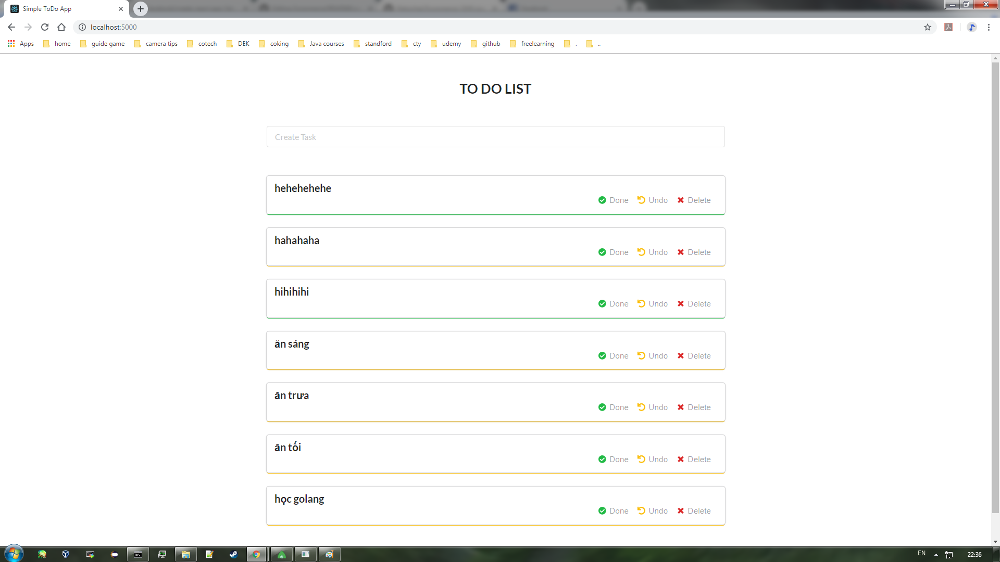
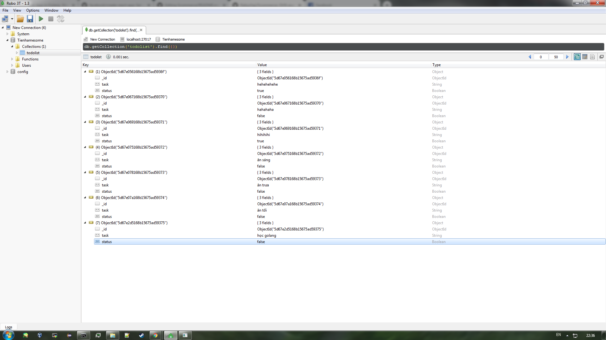
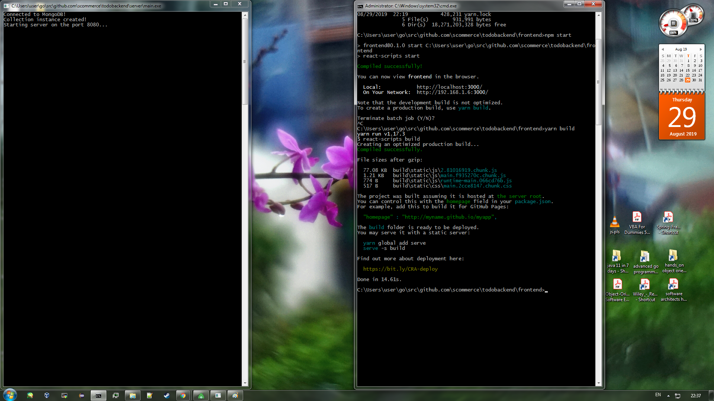

# Scommerce
#### GHN exercises

#### This repo included 2 things:  
#### 1. simple Todo app:  
* Go for backend  
* React for frontend  
* MongoDb for database

#### 2. Discuss solutions for getting unique number in an array (details in [doc](./Solutions.md) and code in `algorithms` folder )  

## How to run simple Todo App:
1. Make sure you have mongodb and it's enable and config mongdodb in default: localhost:27017 (or config suitable with your system)
2. about backend, if you run by using main.exe, it's ok. But if you wanna run by "go run main.go", you should put this repo in goPATH,
then, please make sure that you have all ... things in your system (your gopath or goroot):
`go.mongodb.org/mongo-driver` ---> go get go.mongodb.org/mongo-driver  
`github.com/gorilla/mux` ---> go get github.com/gorilla/mux

### Frontend:
You can see 3 files in repo, we need 3 files, but that is not enough, we must follow commands to create the rest:
First, we need create a repo using `create-react-app`

`npm install -g create-react-app`  (install nodejs for npm)  
`npm install axios`  (you will need it for restAPI)  
`npm install semantic-ui-react`
Now, we return to 3 files in beginning: 
  1. replace `index.html` to one in `public` folder
  2. replace `App.js` and `To-Do-List.js` in `src` folder
Before start by using `npm start`, I think we should start backend first
### Backend:
on Windows: you can run main.exe file to start a server which listens on port 8080 (consider about port 8080)
on linux: 
  1. you can clone this repo
  2. cd backend
  3. go run main.go to start server (consider about port 8080 if you have any service which uses this port)
  (Note: If you wanna run by `go run main.go`, please make sure that you have all package in you gopath)

Then, run:
`npm start` 
(Here I recommened install yarn and run `yarn build` ---> `yarn global add serve` ---> `serve -s build` to save your CPU)  

If there is nothing wrong, we can have something like these:

